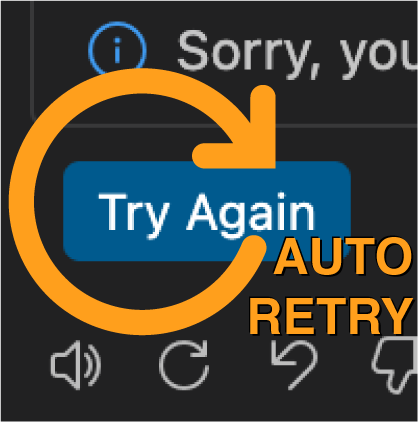

# Copilot Auto-Retry

<p align="center">
  
</p>

[](https://marketplace.visualstudio.com/items?itemName=MaximMazurok.vscode-copilot-auto-retry)
[](https://marketplace.visualstudio.com/items?itemName=MaximMazurok.vscode-copilot-auto-retry)
[](https://marketplace.visualstudio.com/items?itemName=MaximMazurok.vscode-copilot-auto-retry)
[](https://open-vsx.org/extension/MaximMazurok/vscode-copilot-auto-retry)
[](LICENSE)

**Automatically retries transient GitHub Copilot failures** — rate limits, network errors, and service disruptions — so you don't have to sit and click "Try Again" manually.

---

## The Problem

You're in the middle of an agent mode session and Copilot Chat shows:

> **Sorry, you have exhausted this model's rate limit. Please wait a moment before trying again, or switch to GPT-4.1. [Learn More](https://aka.ms/copilot-rate-limits)**

You click "Try Again". It fails again. You wait. You click again. And again.

This extension **does that for you**, automatically, with exponential backoff — so you can step away and come back to a working session.

## Features

- **Automatic retry on rate limits** — Detects "exhausted this model's rate limit" errors and retries with exponential backoff
- **Network recovery** — Monitors connectivity to GitHub/Copilot endpoints and retries when your network comes back online
- **Exponential backoff with jitter** — Spreads retries over time to avoid hammering the API (2s → 4s → 8s → ...)
- **Safety guardrails** — Hard rate limits (max 15 retries/minute), cooldown periods, and a kill switch to prevent runaway loops
- **Status bar indicator** — Shows current state at a glance: idle, waiting, retrying, cooldown, or disabled
- **Manual retry command** — Trigger a retry immediately with `Cmd+Shift+R` / `Ctrl+Shift+R`
- **Zero configuration** — Works out of the box with sensible defaults. All settings are optional.

## Install

### VS Code Marketplace

**[Install from VS Code Marketplace](https://marketplace.visualstudio.com/items?itemName=MaximMazurok.vscode-copilot-auto-retry)**

Or search for **"Copilot Auto-Retry"** in the VS Code Extensions view (`Cmd+Shift+X` / `Ctrl+Shift+X`).

### Open VSX (for VS Codium, Gitpod, Theia, etc.)

**[Install from Open VSX](https://open-vsx.org/extension/MaximMazurok/vscode-copilot-auto-retry)**

### Manual Install

```bash
code --install-extension copilot-auto-retry-0.1.0.vsix
```

## How It Works

1. The extension passively monitors Copilot's health using the VS Code Language Model API
2. When a transient error is detected (rate limit, network issue, model unavailability), a retry cycle begins
3. Each retry focuses the chat panel and submits a follow-up message asking Copilot to continue
4. Retries use exponential backoff: 2 seconds, then 4, then 8, up to your configured maximum
5. If all retries are exhausted, a 60-second cooldown kicks in before monitoring resumes

The extension **never reads your prompts or responses** — it only checks whether Copilot is accepting requests.

## Commands

Open the Command Palette (`Cmd+Shift+P` / `Ctrl+Shift+P`) and type:

| Command | Description |
|---|---|
| **Copilot Auto-Retry: Enable** | Enable the extension |
| **Copilot Auto-Retry: Disable** | Disable the extension and cancel active retries |
| **Copilot Auto-Retry: Toggle Enabled** | Toggle on/off (also available by clicking the status bar item) |
| **Copilot Auto-Retry: Retry Now** | Manually trigger an immediate retry (`Cmd+Shift+R` / `Ctrl+Shift+R`) |
| **Copilot Auto-Retry: Show Status** | Display detailed status in the output channel |

## Settings

All settings are under `copilotAutoRetry.*` in VS Code Settings.

| Setting | Default | Description |
|---|---|---|
| `copilotAutoRetry.enabled` | `true` | Enable automatic retry of transient failures |
| `copilotAutoRetry.maxRetries` | `3` | Maximum retry attempts per failure (1–10) |
| `copilotAutoRetry.baseDelayMs` | `2000` | Base delay before first retry in milliseconds (500–15,000) |
| `copilotAutoRetry.maxDelayMs` | `30000` | Maximum backoff cap in milliseconds (5,000–120,000) |
| `copilotAutoRetry.healthPollIntervalMs` | `5000` | Interval between health checks in milliseconds (2,000–60,000) |

## What Errors Does It Handle?

The extension detects and retries these transient failure types:

| Error Type | Examples |
|---|---|
| **Rate limits** | "Sorry, you have exhausted this model's rate limit. Please wait a moment before trying again, or switch to GPT-4.1", HTTP 429 |
| **Network issues** | Connection refused, connection reset, DNS failures, timeouts |
| **Service disruptions** | HTTP 502/503, "service unavailable", "temporarily unavailable" |
| **Model unavailability** | Models disappearing from `vscode.lm`, Copilot extension becoming inactive |

It does **not** retry non-transient errors like authentication failures, expired subscriptions, or content filter blocks — those require user action.

## Status Bar

The status bar item (right side) shows the current state:

| Icon | State | Meaning |
|---|---|---|
| $(check) Copilot Retry | **Idle** | Monitoring normally, no errors detected |
| $(clock) Retry 1/3 | **Waiting** | Backoff timer counting down before next attempt |
| $(sync~spin) Retrying 1/3 | **Retrying** | Executing a retry right now |
| $(warning) Retry Cooldown | **Cooldown** | All retries exhausted, waiting before resuming |
| $(x) Copilot Retry: Off | **Disabled** | Extension is disabled |

Click the status bar item to toggle the extension on/off.

## Requirements

- VS Code 1.90 or later
- GitHub Copilot extension installed

## Privacy

This extension:

- **Does not read** your prompts, responses, or conversation content
- **Does not send** any data to external services (beyond VS Code's built-in commands)
- **Does not wrap** or intercept Copilot's request pipeline
- Health probes use a minimal single-token request that is cancelled immediately (zero quota cost)
- Network probes send HTTP HEAD requests to `api.github.com` and Copilot endpoints only to check reachability

## Contributing

See [CONTRIBUTING.md](CONTRIBUTING.md) for architecture details, design decisions, and development setup.

## License

[MIT](LICENSE)

---

<sub>This extension was AI-generated with Claude Opus 4.6 (Anthropic) under human supervision by [Max Mazurok](https://github.com/Maxim-Mazurok).</sub>
